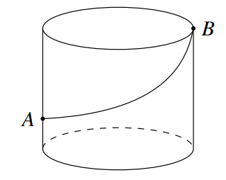

```latex
\begin{tikzpicture}
    \draw (0,0) ellipse (1.25 and 0.35);
    \draw (-1.25,0) -- (-1.25,-2);
    \node [left] (A) at (-1.25,-1.5) {$A$};
    \draw (-1.25,-2) arc (180:360:1.25 and 0.35);
    \draw [dashed] (-1.25,-2) arc (180:360:1.25 and -0.35);
    \draw (1.25,-2) -- (1.25,0) node [right] {$B$};
    \draw (-1.25,-1.5) .. controls (0.85,-1.4) and (1.15, -0.5) .. (1.25,0);
    \fill (-1.25,-1.5) circle (1pt);
    \fill (1.25,0) circle (1pt);
\end{tikzpicture}
```


